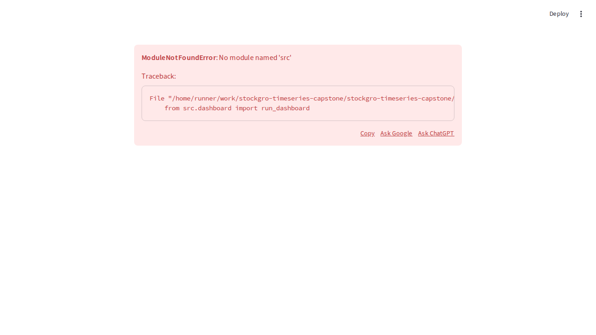

# TSA Capstone 2026 — Time Series Analysis & Virtual Portfolio Management


A professional quantitative finance and time-series research repository for the **Consulting & Analytics Club, IIT Guwahati × StockGro** capstone.

## Project Overview

This project delivers an end-to-end system for:
- NSE stock universe selection
- Time-series forecasting
- Volatility modelling
- Portfolio optimization
- Trading signal simulation
- Evaluation dashboards and report-ready outputs

## Objectives

- Forecast stock prices with 2-day (live) and 5-day (validation) horizons
- Compare classical and ML forecasting models
- Build risk-aware portfolios and simulate trading strategies
- Produce publication-quality visualizations and professional analytics artifacts

## Data & Scope

- **Source**: Yahoo Finance (`yfinance`)
- **Date Range**: 2021-01-01 to 2025-12-31
- **Validation Policy**: Final 6 months reserved for testing
- **Universe**: HDFCBANK.NS, TCS.NS, SUNPHARMA.NS, HINDUNILVR.NS, MARUTI.NS, RELIANCE.NS

### Why this stock universe?

- **Sector diversification**: banking, IT, pharma, FMCG, auto, and energy.
- **Liquidity and tradability**: all names are large-cap and highly liquid in NSE.
- **Volatility profile mix**: combines defensive and cyclical exposures.
- **Trend and correlation balance**: supports diversification-aware portfolio optimization.

## Methodology Snapshot

1. Data collection with retry + integrity checks
2. Preprocessing, outlier handling, stationarity testing (ADF/KPSS)
3. Forecasting (ARIMA, SARIMA, Holt-Winters, Prophet, LSTM, baseline)
4. Volatility and risk analytics (rolling vol, GARCH, VaR, Sharpe, Sortino, drawdown)
5. Portfolio construction (forecast-guided, volatility-aware, momentum-risk balanced)
6. Trading simulation (signals, stop-loss, position sizing, benchmark comparison)
7. Evaluation (RMSE, MAE, MAPE, directional accuracy, R², bias)

## Repository Structure

```text
tsa-capstone-stockgro-2026/
├── data/
│   ├── raw/
│   ├── processed/
│   └── external/
├── notebooks/
├── outputs/
│   ├── forecasts/
│   ├── volatility/
│   ├── reports/
│   ├── trading_logs/
│   ├── portfolio_results/
│   └── figures/
├── src/
├── app/
├── reports/
├── tests/
├── config/
├── requirements.txt
├── README.md
├── main.py
└── LICENSE
```

## Installation

```bash
python -m venv .venv
source .venv/bin/activate
pip install -r requirements.txt
```

## Execution

```bash
python main.py
```

## Dashboard

```bash
streamlit run app/streamlit_dashboard.py
```

### Dashboard Screenshot



## Outputs

- Forecast CSVs in `outputs/forecasts/`
- Volatility/risk artifacts in `outputs/volatility/`
- Trading logs in `outputs/trading_logs/`
- Portfolio outputs in `outputs/portfolio_results/`
- Run summaries in `outputs/reports/`

## Results Summary

The architecture supports transparent model comparison, risk-adjusted portfolio construction, and workflow reproducibility suitable for capstone evaluation and portfolio showcasing.

## Future Improvements

- Factor-model integration
- Probabilistic scenario simulation
- Transaction-cost-aware execution modelling
- Live API integration for strategy monitoring

## Acknowledgements

- Consulting & Analytics Club, IIT Guwahati
- StockGro
- Open-source Python ecosystem contributors

## Author

Parth Pariwandh

## License

Distributed under the MIT License.
